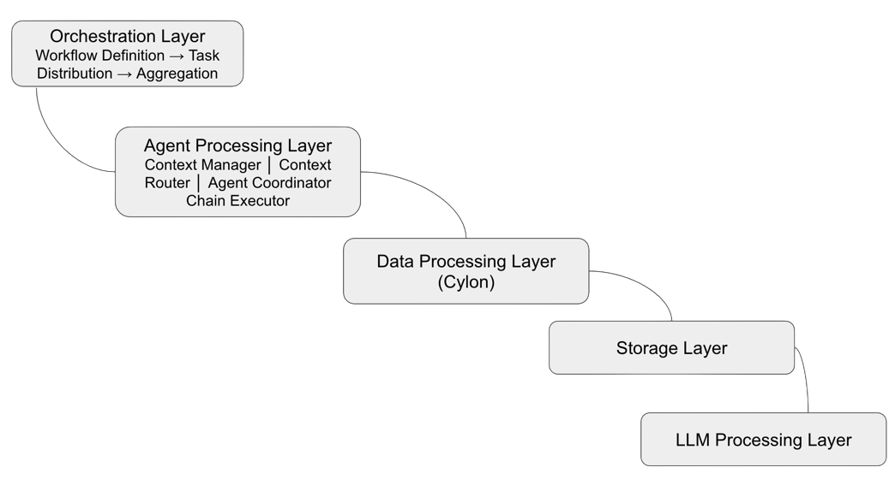

# Cylon Armada

**Context-Based Cost Optimization for Multi-Agent LLM Workflows**

Cylon Armada reduces LLM costs by 60-80% in multi-agent workflows through intelligent context reuse based on semantic similarity. Built on the [Cylon](https://github.com/mstaylor/cylon) distributed computing platform, it provides SIMD-accelerated similarity search, serverless model parallelism, and fault-tolerant execution via AWS Step Functions.

## Key Metrics

| Metric | Target |
|--------|--------|
| Cost Reduction | 60-80% |
| Similarity Search | <20ms for 1,000 contexts |
| SIMD Speedup | 2-4x vs scalar |
| Scalability | 10,000+ contexts per node |
| Context Reuse Rate | 60-80% (task-dependent) |

## Core Innovation

The **Context Similarity Engine** identifies semantically similar LLM contexts using embeddings and SIMD-accelerated cosine similarity (via Cylon), enabling intelligent reuse of LLM outputs across agents and workflows. Instead of making redundant LLM calls, agents check for existing similar contexts first — paying only the cost of an embedding lookup rather than a full LLM invocation.

### Three Execution Paths

| Path | Runtime | SIMD Backend | Search Pattern |
|------|---------|-------------|----------------|
| **A1** | Python + pycylon | Native C++ (AVX2/SSE/NEON) | Per-call: N Python→C++ calls |
| **A2** | Python + Cython | Native C++ via `batch_search.pyx` | Batch: 1 Python→C++ call for entire search |
| **B** | Node.js + cylon-wasm | WASM SIMD128 | Per-call: N WASM calls |

All three paths use Cylon's `cosine_similarity_f32` — the difference is the call pattern and boundary crossing overhead.

### Cylon ContextTable (Arrow-Native)

The context store uses Cylon's `ContextTable` — an Arrow-native key-value store with:
- **FixedSizeList\<Float32\>** embedding columns for zero-copy SIMD access
- **O(1)** put/get/remove via hash index with tombstone-based deletion
- **Arrow IPC** serialization for Redis persistence and FMI broadcast
- Configurable via `context_backend`: `"cylon"` (default) or `"redis"` (legacy)

## Architecture



## Components

### Context Manager
Arrow-native context store via Cylon ContextTable. Stores embeddings as Arrow FixedSizeList columns with zero-copy SIMD search. DynamoDB for persistence, Redis for hot caching via Arrow IPC. Backend is configuration-driven (`context_backend` in BedrockConfig).

### Context Router
Finds similar contexts using Cylon's SIMD-accelerated cosine similarity. Supports three backends (PYCYLON, CYTHON_BATCH, NUMPY) with configurable similarity threshold. Searches 1,000 contexts in under 20ms.

### Agent Coordinator + Step Functions
Orchestrates multi-task workflows via AWS Step Functions (Express Workflow). Three states: PrepareTasks → Map (parallel workers) → AggregateResults. Supports both Python (S3 script runner pattern) and Node.js (direct dispatch) workflows.

### Chain Executor
LangChain + AWS Bedrock integration for LLM invocation. Uses `ChatBedrock` with configurable model IDs, temperature, and token tracking. Supports context-augmented execution for near-threshold matches.

### Cost Tracker
Registry-based model pricing with longest-prefix matching. Tracks per-model LLM costs, embedding costs, and cache hit savings. Pricing resolved from config file → AWS Pricing API → static defaults.

### FMI Communicator Bridge
Inter-Lambda communication via Cylon's FMI communicator. Supports context broadcasting (rank 0 → all workers), cost reduction, and tensor exchange for model parallelism. Channel types: Redis, Direct (TCPunch), S3.

### cosmic-ai Integration
Real astronomical inference workloads from the AI-for-Astronomy project (arXiv:2501.06249). AstroMAE model (ViT + Inception) for photometric redshift prediction from SDSS data. Tasks generated dynamically from real inference results via configurable templates.

### Serverless Model Parallelism
ONNX model partitioning across Lambda functions via FMI. AstroMAE splits into parallel stages (ViT encoder + Inception branch), with FMI all-gather for tensor exchange. Memory-aware partitioning with per-stage Lambda memory recommendations.

## Configuration

All configuration resolves with precedence: **Env vars → Event payload → Config file → Defaults**

```bash
# Bedrock models
BEDROCK_LLM_MODEL_ID=anthropic.claude-3-haiku-20240307-v1:0
BEDROCK_EMBEDDING_MODEL_ID=amazon.titan-embed-text-v2:0
BEDROCK_EMBEDDING_DIMENSIONS=1024
SIMILARITY_THRESHOLD=0.85

# Context backend
CONTEXT_BACKEND=cylon  # "cylon" (Arrow SIMD, default) or "redis" (numpy+bytes)

# Infrastructure
REDIS_HOST=localhost
REDIS_PORT=6379
AWS_DEFAULT_REGION=us-east-1

# FMI communicator
FMI_CHANNEL_TYPE=redis  # "redis", "direct", "s3"
FMI_HINT=fast
RANK=0
WORLD_SIZE=1
```

## Project Structure

```
cylon-armada/
├── target/
│   ├── shared/scripts/                      # Shared libraries
│   │   ├── context/
│   │   │   ├── manager.py                   # Context Manager (Cylon ContextTable + DynamoDB)
│   │   │   ├── router.py                    # Context Router (SIMD similarity search)
│   │   │   └── embedding.py                 # Embedding Service (Bedrock Titan V2)
│   │   ├── chain/
│   │   │   └── executor.py                  # LangChain Executor (Bedrock LLM)
│   │   ├── simd/
│   │   │   ├── batch_search.pyx             # Cython batch SIMD search (Path A2)
│   │   │   └── setup.py                     # Build config (requires CYLON_PREFIX)
│   │   ├── coordinator/
│   │   │   └── agent_coordinator.py         # Step Functions orchestration
│   │   ├── communicator/
│   │   │   └── fmi_bridge.py                # FMI inter-Lambda communication
│   │   ├── cost/
│   │   │   └── bedrock_pricing.py           # Cost tracking + config resolution
│   │   └── run_action.py                    # Lambda action dispatcher
│   ├── aws/scripts/
│   │   ├── lambda/
│   │   │   ├── python/handler.py            # S3 script runner (Cylon lambda_entry1.py pattern)
│   │   │   └── node/
│   │   │       ├── context_handler.mjs      # Path B: WASM SIMD + cost tracking
│   │   │       ├── inference.mjs            # ONNX inference + model parallelism
│   │   │       ├── task_generator.mjs       # Astronomical task generation
│   │   │       └── package.json
│   │   ├── step_functions/
│   │   │   ├── workflow.asl.json            # Python path (S3 script runner)
│   │   │   ├── workflow_nodejs.asl.json     # Node.js path (direct dispatch)
│   │   │   └── workflow_model_parallel.asl.json  # Model parallelism
│   │   └── terraform/                       # AWS infrastructure (Lambda, Step Functions, DynamoDB)
│   └── experiments/
│       ├── runner.py                        # Experiment matrix runner
│       ├── cosmic_ai/                       # Astronomical inference experiments
│       │   ├── inference.py                 # AstroMAE inference module
│       │   ├── task_generator.py            # LLM tasks from SDSS data
│       │   ├── export_onnx.py              # ONNX export + model partitioning
│       │   └── blocks/                      # Model architecture (ViT + Inception)
│       └── scenarios/                       # Test scenario configs
├── docker/
│   ├── Dockerfile.python                    # Path A1/A2 (Cylon + cylon_dev conda env)
│   └── Dockerfile.nodejs                    # Path B (WASM + ONNX Runtime)
├── tests/                                   # Python tests (pytest)
└── docs/
    └── PHASE1_IMPLEMENTATION_PLAN.md        # Implementation plan
```

## Building and Deployment

### Prerequisites

- [Cylon](https://github.com/mstaylor/cylon) built with `-DCYLON_USE_REDIS=1 -DCYLON_FMI=1 -DCYLON_SIMD=1 -DCYLON_CONTEXT=1`
- `cylon_dev` conda environment
- AWS account with Bedrock model access

### Local Development

```bash
# Activate Cylon conda environment
conda activate cylon_dev

# Install cylon-armada dependencies
pip install langchain-aws langchain-core cython

# Build Cython SIMD extension (Path A2)
cd target/shared/scripts/simd
CYLON_PREFIX=/path/to/cylon/install python setup.py build_ext --inplace

# Run tests
python -m pytest tests/ -v

# Run experiments locally
python target/experiments/runner.py --tasks 4 8 --thresholds 0.8 --dimensions 256

# Run with cosmic-ai data
python target/experiments/runner.py --cosmic-ai \
    --data-path /path/to/sdss/data.pt \
    --model-path /path/to/astromae/model.pt \
    --tasks 8 16
```

### Lambda Deployment

```bash
# Build Python Docker image (Path A1/A2)
docker build -t cylon-armada-python -f docker/Dockerfile.python .

# Build Node.js Docker image (Path B)
docker build -t cylon-armada-nodejs -f docker/Dockerfile.nodejs .

# Push to ECR
aws ecr get-login-password | docker login --username AWS --password-stdin $ACCOUNT_ID.dkr.ecr.us-east-1.amazonaws.com
docker tag cylon-armada-python $ACCOUNT_ID.dkr.ecr.us-east-1.amazonaws.com/cylon-armada-python:latest
docker push $ACCOUNT_ID.dkr.ecr.us-east-1.amazonaws.com/cylon-armada-python:latest

# Deploy infrastructure
cd target/aws/scripts/terraform
terraform init
terraform apply
```

### ONNX Model Export (for Node.js Path B)

```bash
# Full model export
python target/experiments/cosmic_ai/export_onnx.py \
    --model-path /path/to/model.pt \
    --output-path astromae.onnx

# Partitioned export (model parallelism)
python target/experiments/cosmic_ai/export_onnx.py \
    --model-path /path/to/model.pt \
    --output-dir partitions/ \
    --partition

# Memory estimation only
python target/experiments/cosmic_ai/export_onnx.py \
    --model-path /path/to/model.pt \
    --memory-report
```

## Technology Stack

| Layer | Technologies |
|-------|-------------|
| Languages | Python 3.10, C++ (via pycylon), Rust (via cylon-wasm), Node.js 18 |
| Data Processing | Cylon ContextTable (Arrow), SIMD cosine similarity, Cython batch search |
| SIMD | C++ AVX2/SSE4.2/NEON (Path A), Rust WASM SIMD128 (Path B) |
| LLM Provider | AWS Bedrock (Claude, Nova, Llama, Titan Embeddings V2) |
| LLM Framework | LangChain (Python), direct Bedrock API (Node.js) |
| Orchestration | AWS Step Functions (Express Workflow) |
| Communication | Cylon FMI Communicator (Redis, Direct/TCPunch, S3 channels) |
| Storage | DynamoDB (persistence), Redis/ElastiCache (cache), S3 (scripts, models) |
| ML Inference | PyTorch (Python), ONNX Runtime (Node.js), model parallelism via FMI |
| Infrastructure | Terraform, Docker, cylon_dev conda environment |
| Testing | pytest (Python), Jest (Node.js) |

## How Context Reuse Works

```
1. Agent receives task
2. Generate embedding via Amazon Titan Text Embeddings V2
3. SIMD cosine similarity search on Cylon ContextTable (Arrow memory)
4. If similarity >= threshold (configurable, default 0.85):
     → Return cached context (cost: ~$0.00002 embedding only)
5. Else:
     → Invoke LLM via LangChain + Bedrock (cost: ~$0.002)
     → Store result + embedding in ContextTable for future reuse
```

At a 75% reuse rate, this reduces per-task cost from $0.00202 to $0.00052 — a **74% reduction**.

## Experiment Scenarios

| Scenario | Tasks | Expected Reuse | Domain |
|----------|-------|---------------|--------|
| Code Review (high similarity) | 32 | 60-70% | Software Engineering |
| Documentation (moderate similarity) | 32 | 40-50% | Software Engineering |
| Bug Analysis (low similarity) | 32 | 20-30% | Software Engineering |
| Mixed Workload (realistic) | 48 | 40-55% | Software Engineering |
| Astronomical Inference (cosmic-ai) | Dynamic | 50-65% | Science (SDSS/AstroMAE) |

## Roadmap

- [x] **Phase 0** — Cylon foundation (pycylon, SIMD, FMI communicator, ContextTable, cylon-wasm)
- [ ] **Phase 1** — Proof-of-concept (context store, similarity engine, 3 execution paths, cosmic-ai, Step Functions, model parallelism)
- [ ] **Phase 2** — Deployment (Terraform IaC, advanced Step Functions, swarm orchestration)
- [ ] **Phase 3** — Multi-agent orchestration (cognitive diversity, custom swarm implementation via Cylon communicator)
- [ ] **Phase 4** — Large-scale experiments (100K+ tasks, publication-quality results, GPU benchmarks)
- [ ] **Phase 5** — Thesis and publications

## Related Projects

- [Cylon](https://github.com/mstaylor/cylon) — Distributed data processing framework (foundation)
- [AI-for-Astronomy](https://github.com/mstaylor/AI-for-Astronomy) — AstroMAE astronomical inference (cosmic-ai experiments)

## References

- Cylon: A Fast, Scalable, Universal Distributed Data Processing Framework
- Scalable Cosmic AI Inference using Cloud Serverless Computing with FMI (arXiv:2501.06249)

## License

TBD